# Jiva Farm OS Role-Based Usage Manual

Version: v0.18
Status: Draft  
Last updated: 17 Jul 2026
Owner: Jiva Farm OS Admin / Management  
Audience: Internal Jiva Farm OS users  

## 1. How To Use This Manual

This is a practical ready-reckoner for day-to-day Jiva Farm OS use. It shows what each role can see, what each role should do, where work moves next, and where not to take action.

This manual will be updated as Jiva Farm OS workflows, role permissions, modules, and operating practices evolve.

Use it when:

- onboarding a new internal user
- deciding which menu to use for a task
- checking whether a user should create, update, approve, or only view
- explaining how workflows move between teams

## Version history

| Version | Date | Status | Notes |
|---|---|---|---|
| v0.18 | 17 Jul 2026 | Draft | Adds Marketing Library browsing, cross-role approval, private file/YouTube content, and manually revocable customer links. |
| v0.17 | 10 Jul 2026 | Draft | Adds My Work as home, Action Center sidebar placement, Inventory lifecycle cards, Dispatch and Free Pilot corrections, Installation auto-linking, Marketing completion tracking, and current operating guidance. |
| v0.16 | 10 Jul 2026 | Draft | Merges Home/Dashboard into My Work as the primary signed-in landing page while keeping Notifications separate. |
| v0.15 | 10 Jul 2026 | Draft | Adds Phase 1/2 n8n integration guidance: selected app events can notify n8n, and n8n can pull a secret-protected read-only daily summary. |
| v0.14 | 09 Jul 2026 | Draft | Adds Admin-controlled per-user CSV download permission guidance. CSV export is off by default and still respects module visibility and record scope. |
| v0.13 | 09 Jul 2026 | Draft | Adds safe CSV export guidance for operational list pages, including role-scoped exports, current-filter exports, row limits, and no raw backend IDs by default. |
| v0.12 | 09 Jul 2026 | Draft | Adds Activity Timeline guidance for important detail pages using existing follow-ups, reviews, meetings, visits, reports, marketing updates, and delete/restore audit fields. |
| v0.11 | 09 Jul 2026 | Draft | Adds lightweight Getting Started checklist guidance for account readiness, first actions, and role-specific onboarding inside Help / SOP and My Work. |
| v0.10 | 09 Jul 2026 | Draft | Adds in-app Help / SOP role-wise training guide alignment, including daily checklists, main pages, handoffs, avoid lists, and escalation points for each role. |
| v0.9 | 09 Jul 2026 | Draft | Final launch polish: updates sidebar navigation groups, session/password guidance, Marketing deadline workflow notes, brief document link guidance, and soft-delete/restore training notes. |
| v0.8 | 09 Jul 2026 | Draft | Adds Admin/Management System Health for KPI cache, dispatch aging, installation aging, pilot visit risk, marketing risk, and deleted-record visibility. |
| v0.7 | 09 Jul 2026 | Draft | Adds Admin/Management Data Quality warnings for duplicate, incomplete, dispatch-readiness, pilot setup, and marketing workflow review. |
| v0.6 | 09 Jul 2026 | Draft | Adds My Pending Work as a live role-scoped action list for Sales, Dispatch, Pilots & Visits, and Marketing. |
| v0.5 | 09 Jul 2026 | Draft | Adds soft-delete audit trail, delete reason capture, Admin-only deleted-record views, and restore guidance for Dealers, Institutional Partners, and Pilots. |
| v0.4 | 09 Jul 2026 | Draft | Adds paid farmer sale dispatch vs free pilot dispatch routing, device pool rules, and dispatch handoff guidance. |
| v0.3 | 09 Jul 2026 | Draft | Adds controlled soft-delete guidance for Dealers, Institutional Partners, and Pilots. |
| v0.2 | 09 Jul 2026 | Draft | Adds Marketing Requests module, Marketing Head and Designer role guidance, and marketing request workflow/access rules. |
| v0.1 | 09 Jul 2026 | Draft | Initial role-based ready-reckoner covering menu access, workflows, role guides, status references, and items to confirm. |

## 2. Role Legend

| Role | Department / function | Primary responsibility in the system |
|---|---|---|
| Admin | System administration | Full app administration, user setup, master access, emergency correction |
| Management | Leadership | Company-wide visibility, pilot oversight where allowed, dashboard review |
| Sales Head | Sales leadership | Sales pipeline, dealer/institution oversight, RSM/region review, KPI refresh |
| RSM | Regional sales | Region/state pipeline, dealer progress, installations, follow-ups |
| Salesperson | Field sales | Farmer leads, follow-ups, sales-linked installations |
| Agronomist | Agronomy / technical | Pilot visibility, technical oversight, visit/report review, field guidance |
| Research Assistant | Field research | My Visits, visit reports, pilot observations, field evidence |
| R&D Head | R&D leadership | Pilot review, R&D approval, reports, agronomy performance |
| Marketing Head | Marketing leadership | Review and deliver Marketing Requests; upload material and publish Designer submissions |
| Designer | Marketing execution | Complete Marketing Requests; upload material and publish Marketing Head submissions |
| Accounts | Finance | Payment confirmation, device/dispatch finance checks |
| Stock / Dispatch | Customer Service Team | Inventory/device records, dispatches, operational installation support |
| HR & Legal | Legal / compliance | Dealer and institution legal approval workflows |
| Viewer | Read-only observer | Read-only visibility across permitted operational modules |

## 3. Access Symbol Legend

| Symbol | Meaning |
|---|---|
| ⭐ | Primary work area |
| ✅ | Full / broad access for that role |
| ✏️ | Can create or update records |
| 👁 | View only |
| ⚠️ | Limited or scope-based access |
| 🔒 | No access / hidden |

Notes:

- Secondary roles add access. They do not remove the primary role's access.
- Viewer remains read-only.
- Help / SOP and Change Password are available to signed-in users.
- First-login password-change users see only Change Password and Sign out until password is changed.
- If a user's session expires, they should log in again and return to the page they were using. The app separates expired-session messages from permission-denied messages.
- My Work is the signed-in landing page for most roles.
- Dashboard is no longer a separate sidebar item.
- Action Center sits directly below the logo and opens Notifications.
- Daily Work contains My Work and My Visits where permitted.
- Marketing Head and Designer use Marketing Requests as their role home page.

## 4. Master Role-Menu Access Matrix

### Sidebar Navigation Groups

| Group | Menus | Training notes |
|---|---|---|
| Daily Work | My Work; My Visits | Daily action areas. Notifications open from Action Center. Visit Reports are submitted through My Visits or Pilot detail, not as a standalone sidebar page. |
| Sales & Partners | Farmer Leads; Dealers; Institutional Partners | Contacts and meetings are managed inside Institutional Partner detail where available. |
| R&D | Pilots | Pilots stay under R&D only. |
| Operations | Inventory; Dispatches; Installations; Post Installation Follow-ups | Inventory/device records, dispatch, installation, and after-installation work stay under Operations only. |
| Team Workflows | Marketing Requests | Creative request workflow for briefs, deadlines, draft links, comments, and final OneDrive links. |
| Management | Data Quality; System Health; Regions; Internal Users | Visibility is role-controlled; most items are Admin/Management-only. My Work carries role KPI cards and oversight. |
| Support | Help / SOP; Change Password | Support items are available to signed-in users; Change Password remains available during forced first-login password change. |

### In-App Help / SOP Training Guide

The Help / SOP page is the short in-app training version of this manual. It is organized role-wise and includes:

- role purpose
- daily checklist
- main pages to use
- key handoffs owned
- what not to do
- escalation points

The current user's primary and secondary role sections appear first where available. Help / SOP is guidance only; it does not change permissions, RLS, or workflow authority.

### Getting Started Checklist

My Work includes a small Getting Started card that links to Help / SOP. The Help / SOP page includes a dynamic Getting Started Checklist that uses existing profile data only.

It helps users confirm:

- name is present
- role is present
- region/state is present where applicable
- temporary password has been changed where required
- user has reviewed their role SOP
- user knows to open My Work
- user knows to contact Admin for profile/access corrections

The checklist is guidance only. It does not store completed steps, change permissions, or create a new onboarding workflow.

### Activity Timelines

Important detail pages include an Activity Timeline section where existing history data is available. Timelines are read-only and help users understand recent record history.

Current timeline sources include:

- Farmer Lead creation, follow-ups, payment confirmation, dispatch, installation, and linked follow-up records
- Dealer creation, dealer reviews, dispatches, installations, linked pilots, and delete/restore audit fields
- Institutional Partner creation, contacts, meetings, linked pilots, linked Farmer Leads, dealer opportunities, and delete/restore audit fields
- Pilot creation, Monitoring Plan visits, actual visits, Visit Reports, pilot dispatch, device installation, and delete/restore audit fields
- Marketing Request creation, deadline decisions, workflow updates, comments, draft/final links, and delivery timestamps

Activity Timelines do not use a generic audit table yet. They do not change permissions, RLS, schema, or workflows.

### CSV Exports

Key operational list pages include an Export CSV action for offline review and management reporting.

Current export-enabled pages:

- Farmer Leads
- Dealers
- Institutional Partners
- Pilots
- Marketing Requests

Export rules:

- Admin controls CSV download permission per user from Internal Users.
- The permission label is `Can download CSV files`.
- CSV download is off by default for all users until Admin enables it.
- Exports use the same search/filter values currently applied on the page.
- Exports include only records visible to the signed-in user's role and record scope.
- Export routes enforce the CSV permission server-side; hiding the button is not the security boundary.
- Non-admin users do not export deleted records.
- CSV files use readable names, statuses, links, and DD/MM/YYYY date display.
- Heavy reporting formats such as PDF, XLSX, scheduled reports, and email reports are not included in this phase.
- Data Quality and System Health exports are not added yet because those pages generate live grouped warnings in page-local logic; they should be extracted to shared loaders before adding exports.

### n8n Integration

Jiva Farm OS can notify n8n about selected operational events and can provide a secret-protected daily summary for automation or reporting workflows.

Current one-way events:

- Marketing Request assigned
- Marketing deadline revised
- Paid Farmer Lead ready for dispatch
- Free Pilot dispatch requested
- Visit Report submitted

Operating rules:

- n8n does not write back to Jiva Farm OS in this phase.
- n8n must not update production records.
- The daily summary is read-only and requires a shared secret.
- Payloads are compact and avoid raw backend IDs, emails, full notes, comments, private upload links, and secrets.
- Users should continue using Jiva Farm OS as the source of truth for record updates.

### Marketing Library

Marketing Library is the approved source for material shared with farmers,
dealers, corporates, or the internal team.

Classification order:

1. Audience
2. Sector
3. Crop, shown only for Agriculture
4. Language

Operating rules:

- Every active internal role can browse published material.
- Admin, Marketing Head, and Designer can upload and manage material.
- Marketing Head uploads go to Designer for review.
- Designer uploads go to Marketing Head for review.
- A non-Admin uploader cannot publish their own submission.
- Videos use YouTube links. Other digital material uses the private file upload.
- A customer link works without login and never expires automatically.
- Treat customer links as confidential bearer links and send them only to the
  intended customer or partner.
- The full customer link is shown once. If it is lost, revoke the old link and
  create a new one.
- Revoke a link when material is outdated, shared incorrectly, or no longer
  approved. Archiving the material revokes all its active links.
- Use a Marketing Request's `Add to Marketing Library` action after the request
  is completed when the final output should become reusable approved material.

### Operations Menus

| Role | My Work | Farmer Leads | Dealers | Institutional Partners | Pilots | My Visits | Dispatches | Installations | Post Installation Follow-ups | Inventory | System Health | Data Quality | Marketing Requests | Marketing Library |
|---|---:|---:|---:|---:|---:|---:|---:|---:|---:|---:|---:|---:|---:|---:|
| Admin | ✅ | ✅ ✏️ | ✅ ✏️ | ✅ ✏️ | ✅ ✏️ | ✅ ✏️ | ✅ ✏️ | ✅ ✏️ | ✅ ✏️ | ✅ ✏️ | ✅ | ✅ | ✅ ✏️ | ⭐ ✅ ✏️ |
| Management | ✅ | ✅ | 👁 | 👁 | 👁 | ⚠️ | 👁 | 👁 | 👁 | 👁 | ✅ | ✅ | ✅ ✏️ | 👁 |
| Sales Head | ✅ | ✅ | ⭐ ✏️ | ⭐ ✏️ | 👁 | 👁 | 👁 | 👁 | ✏️ | 👁 | 🔒 | 🔒 | ✏️ ⚠️ | 👁 |
| RSM | ✅ | ✅ ⚠️ | ⭐ ✏️ ⚠️ | ⭐ ✏️ ⚠️ | 👁 ⚠️ | 👁 ⚠️ | 👁 ⚠️ | ✏️ ⚠️ | ✏️ ⚠️ | 🔒 | 🔒 | 🔒 | ✏️ ⚠️ | 👁 |
| Salesperson | ✅ | ✅ ⚠️ | 👁 ⚠️ | 👁 ⚠️ | 🔒 | 👁 ⚠️ | 🔒 | ✏️ ⚠️ | ✏️ ⚠️ | 🔒 | 🔒 | 🔒 | ✏️ ⚠️ | 👁 |
| Agronomist | ✅ | 👁 | 👁 | 👁 | ✏️ ⚠️ | ⭐ ✏️ | 👁 | 👁 | ✏️ | 👁 | 🔒 | 🔒 | ✏️ ⚠️ | 👁 |
| Research Assistant | ✅ | 👁 ⚠️ | 🔒 | 🔒 | 👁 ⚠️ | ⭐ ✏️ ⚠️ | 🔒 | 🔒 | 🔒 | 🔒 | 🔒 | 🔒 | ✏️ ⚠️ | 👁 |
| R&D Head | ✅ | 👁 | 👁 | 👁 | ⭐ ✏️ | 👁 | 👁 | 👁 | 👁 | 👁 | 🔒 | 🔒 | ✏️ ⚠️ | 👁 |
| Marketing Head | ✅ | 🔒 | 🔒 | 🔒 | 🔒 | 🔒 | 🔒 | 🔒 | 🔒 | 🔒 | 🔒 | 🔒 | ⭐ ✅ ✏️ | ⭐ ✅ ✏️ |
| Designer | ✅ | 🔒 | 🔒 | 🔒 | 🔒 | 🔒 | 🔒 | 🔒 | 🔒 | 🔒 | 🔒 | 🔒 | ⭐ ✏️ ⚠️ | ⭐ ✅ ✏️ |
| Accounts | ✅ | ✅ | 👁 ⚠️ | 🔒 | 🔒 | 🔒 | ⭐ ✏️ | 🔒 | 🔒 | 👁 | 🔒 | 🔒 | 🔒 | 👁 |
| Stock / Dispatch | ✅ | ✅ | 👁 ⚠️ | 🔒 | 🔒 | 🔒 | ⭐ ✏️ | ⭐ ✏️ | 🔒 | ⭐ ✏️ | 🔒 | 🔒 | 🔒 | 👁 |
| HR & Legal | 🔒 | 👁 | ⚠️ ✏️ | ⚠️ ✏️ | 🔒 | 🔒 | 🔒 | 🔒 | 🔒 | 🔒 | 🔒 | 🔒 | 🔒 | 👁 |
| Viewer | 👁 | 👁 | 👁 | 👁 | 👁 | 👁 | 👁 | 👁 | 👁 | 👁 | 🔒 | 🔒 | 🔒 | 👁 |

### Team And Utility Menus

| Role | Regions | Internal Users | Help / SOP | Change Password |
|---|---:|---:|---:|---:|
| Admin | ✅ ✏️ | ✅ ✏️ | ✅ | ✅ |
| Management | 👁 | 🔒 | ✅ | ✅ |
| Sales Head | ✏️ | 🔒 | ✅ | ✅ |
| RSM | 🔒 | 🔒 | ✅ | ✅ |
| Salesperson | 🔒 | 🔒 | ✅ | ✅ |
| Agronomist | 🔒 | 🔒 | ✅ | ✅ |
| Research Assistant | 🔒 | 🔒 | ✅ | ✅ |
| R&D Head | 🔒 | 🔒 | ✅ | ✅ |
| Marketing Head | 🔒 | 🔒 | ✅ | ✅ |
| Designer | 🔒 | 🔒 | ✅ | ✅ |
| Accounts | 🔒 | 🔒 | ✅ | ✅ |
| Stock / Dispatch | 🔒 | 🔒 | ✅ | ✅ |
| HR & Legal | 🔒 | 🔒 | ✅ | ✅ |
| Viewer | 🔒 | 🔒 | ✅ | ✅ |

## 5. Role Ready-Reckoners

### Role: Admin

#### Daily purpose

Keep the whole operating system clean, correct, and usable.

#### Primary menus

| Menu | What Admin does there | Access |
|---|---|---|
| Internal Users | Create users, assign roles, activate/deactivate users | ⭐ ✅ ✏️ |
| Regions | Maintain region and RSM setup | ⭐ ✅ ✏️ |
| All operational menus | Review, correct, and unblock workflows | ✅ ✏️ |
| My Work | Review role KPIs, Admin Oversight, and operational bottlenecks | ⭐ ✅ |
| Data Quality / System Health | Review cleanup warnings and process risk | ⭐ ✅ |

#### Daily workflow map

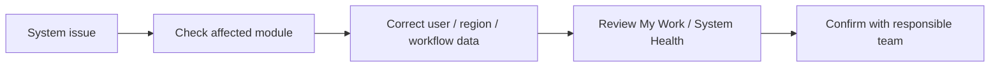

#### Do

- Keep roles and secondary roles accurate.
- Use Regions before assigning RSM-based work.
- Review My Work, Data Quality, and System Health after major data corrections.
- Use Help / SOP to guide users before changing permissions.

#### Don't

- Do not bypass workflows by changing statuses randomly.
- Do not use QA seed in production.
- Do not weaken RLS or use service-role access in app code.

#### Common statuses they will see

| Status | Meaning | What Admin should do |
|---|---|---|
| Inactive user | User cannot work in app | Reactivate or replace only after business confirmation |
| Device Installed | Workflow-controlled stage | Confirm installation record exists |
| KPI/cache stale | Saved or cached operating summary may be stale | Review My Work/System Health and refresh only where the page allows |

#### Escalate to

Harsha / Management for business-rule decisions.

---

### Role: Management

#### Daily purpose

Review company-wide progress and major pilot/dealer/institution outcomes.

#### Primary menus

| Menu | What Management does there | Access |
|---|---|---|
| My Work | Company operating overview, KPIs, and Oversight | ⭐ ✅ |
| Data Quality / System Health | Review cleanup warnings and operational risk | ⭐ ✅ |
| Pilots | Read-only pilot oversight | 👁 |
| Leads / Dealers / Institutions / Inventory / Installations | Review operational state | 👁 |

#### Daily workflow map

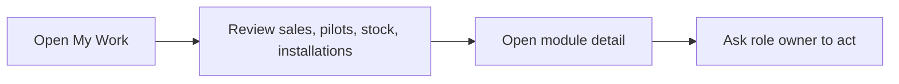

#### Do

- Use My Work for company-wide review and oversight.
- Use details pages to understand blockers.
- Ask Sales Head, R&D Head, or Admin to update source records.

#### Don't

- Do not use Management role as day-to-day data-entry role unless the page explicitly allows it.
- Do not refresh or change data outside the intended workflow.

#### Common statuses they will see

| Status | Meaning | What user should do |
|---|---|---|
| Follow-up Due | Team owes a follow-up | Ask Sales/RSM owner |
| Final Report Pending | Pilot needs R&D review | Ask R&D Head |
| Dormant Dealer | Dealer needs review or closure | Ask Sales Head/RSM |

#### Escalate to

Sales Head for sales/dealer; R&D Head for pilots; Admin for access/data issues.

---

### Role: Sales Head

#### Daily purpose

Own sales pipeline, dealer growth, institution opportunities, regional progress, and KPI refresh.

#### Primary menus

| Menu | What Sales Head does there | Access |
|---|---|---|
| Farmer Leads | Review and manage pipeline | ⭐ ✏️ |
| Dealers | Create dealer profiles and track progress | ⭐ ✏️ |
| Institutional Partners | Create/manage institution opportunities | ⭐ ✏️ |
| My Work | Review sales KPIs, team actions, and dispatch readiness | ⭐ ✅ |
| Regions | Maintain region setup where allowed | ✏️ |

#### Daily workflow map

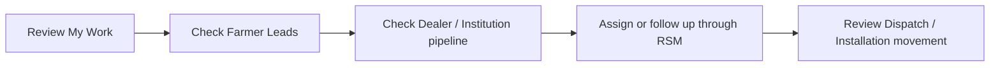

#### Do

- Create Dealer profiles when needed.
- Use Dealer review and next action to keep dealer progress moving.
- Use Institutions for partner opportunities and scale-up.
- Soft-delete Dealers or Institutional Partners only when they should be removed from active views; add a clear delete reason because Admin can audit and restore deleted records later.
- Use My Work for sales KPIs and team action review.

#### Don't

- Do not mark payment confirmed unless acting through allowed finance workflow.
- Do not manually mark workflow-derived milestones that are handled by Dispatch/Installation.

#### Common statuses they will see

| Status | Meaning | What user should do |
|---|---|---|
| Prospect | Dealer is early-stage | Push RSM for profile/review |
| Onboarding | Dealer setup is in progress | Track terms, training, agreement, first order |
| Payment Confirmed | Farmer lead is ready for dispatch planning | Coordinate Accounts/Dispatch |
| Ready for dispatch | Paid lead has payment confirmed and no active dispatch request | Stock / Dispatch creates Farmer Sale Dispatch |

#### Escalate to

Accounts for payment, Stock / Dispatch for dispatch, HR & Legal for agreements, Admin for access.

---

### Role: RSM

#### Daily purpose

Manage assigned region/state pipeline, dealer performance, installations, and follow-ups.

#### Primary menus

| Menu | What RSM does there | Access |
|---|---|---|
| Farmer Leads | Work assigned regional leads | ⭐ ✏️ ⚠️ |
| Dealers | Create/manage dealer records in scope | ⭐ ✏️ ⚠️ |
| Institutional Partners | Manage region-linked institution opportunities | ✏️ ⚠️ |
| Installations | Track and update region installations | ✏️ ⚠️ |
| My Work | Live scoped RSM KPIs and pending work | ⭐ ⚠️ |

#### Daily workflow map

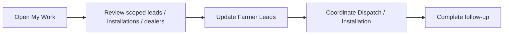

#### Do

- Keep lead owner, RSM, next action, and follow-up data current.
- Use Dealer review and next action to drive dealer progress.
- Use Installations and Follow-ups for field closure.
- Use My Work for assigned-scope KPIs and pending actions.

#### Don't

- Do not expect company-wide visibility; RSM views are live and scoped.
- Do not update legal approval fields unless the workflow allows it.

#### Common statuses they will see

| Status | Meaning | What user should do |
|---|---|---|
| Follow-up Active | Sales follow-up is in progress | Update next action |
| Device Dispatched | Device is on the way | Coordinate installation |
| Follow-up Pending | Installation follow-up is due | Complete follow-up |

#### Escalate to

Sales Head for routing/targets, Accounts for payment, Stock / Dispatch for device movement.

---

### Role: Salesperson

#### Daily purpose

Capture and work farmer leads assigned to the salesperson.

#### Primary menus

| Menu | What Salesperson does there | Access |
|---|---|---|
| Farmer Leads | Create and update assigned leads | ⭐ ✏️ ⚠️ |
| Installations | Work sales-linked installation records | ✏️ ⚠️ |
| Post Installation Follow-ups | Complete assigned follow-ups | ✏️ ⚠️ |
| My Work | Scoped visibility and owned actions where available | 👁 ⚠️ |

#### Daily workflow map

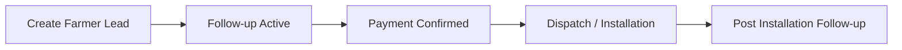

#### Do

- Capture accurate farmer, crop, location, product, and next action.
- Keep lead stage current until payment/dispatch handoff.
- Complete follow-ups assigned to you.

#### Don't

- Do not confirm payment unless Accounts/Admin handles it.
- Do not manually force Device Installed.

#### Common statuses they will see

| Status | Meaning | What user should do |
|---|---|---|
| Lead Captured | New lead exists | Complete first contact |
| Quotation / Estimate Shared | Commercial discussion is active | Follow up |
| Payment Confirmed | Finance checkpoint complete | Coordinate next workflow |

#### Escalate to

RSM for field routing, Sales Head for unresolved commercial decisions.

---

### Role: Agronomist

#### Daily purpose

Own technical pilot oversight and support Research Assistant field work.

#### Primary menus

| Menu | What Agronomist does there | Access |
|---|---|---|
| Pilots | Create/manage pilots and monitoring plans | ⭐ ✏️ |
| My Visits | View field visit flow where relevant | ⭐ ⚠️ |
| Visit Reports through Pilots | Review field notes, evidence, parameters | ⭐ |
| Farmer Leads / Inventory / Installations / Follow-ups | Technical context and follow-up | 👁 / ✏️ where allowed |
| Institutional Partners | Manage technical institution profile fields | ✏️ ⚠️ |

#### Daily workflow map

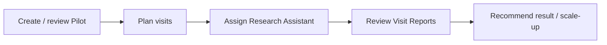

#### Do

- Use Pilots as the main technical cockpit.
- Add planned visits with date, RA, crop stage, and parameters.
- Review observations and evidence.
- Soft-delete Pilots only when they should be removed from active views; add a clear delete reason because Admin can audit and restore deleted records later.
- Keep technical follow-ups clean.

#### Don't

- Do not use finance/admin-only fields.
- Do not treat pilot installation as farmer sale installation.

#### Common statuses they will see

| Status | Meaning | What user should do |
|---|---|---|
| Monitoring Active | Pilot is in field monitoring | Track visits/reports |
| Visit Report Pending | Field report is needed | Follow up with RA |
| Awaiting R&D Review | Final result needs R&D | Escalate to R&D Head |

#### Escalate to

R&D Head for result approval, Research Assistant for visit completion, Admin for access issues.

---

### Role: Research Assistant

#### Daily purpose

Complete assigned pilot visits and submit field visit reports.

#### Primary menus

| Menu | What Research Assistant does there | Access |
|---|---|---|
| My Visits | See assigned visits and submit reports | ⭐ ✏️ |
| Pilots | Create/update pilot work where allowed | ⭐ ✏️ ⚠️ |
| Visit Reports through Pilots/My Visits | Enter observations, notes, evidence | ⭐ ✏️ |
| Farmer Leads | Create/read eligible leads in assigned geography for pilot work | ✏️ ⚠️ |
| My Work | Live user-specific actions and counts | 👁 ⚠️ |

#### Daily workflow map

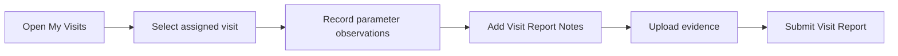

#### Do

- Start from My Visits in the field.
- Submit Visit Report Notes, parameter observations, photos, and data sheet when available.
- Keep evidence clear and factual.
- Use Farmer Leads only within assigned pilot/geography rules.

#### Don't

- Do not mark Pilot Device Installed.
- Do not approve reports for external sharing.
- Do not change R&D approval decisions.

#### Common statuses they will see

| Status | Meaning | What user should do |
|---|---|---|
| Assigned | Visit is assigned to you | Prepare for visit |
| In Progress | Visit work has started | Continue / Submit report |
| Needs report | Visit needs field report | Submit Visit Report |

#### Escalate to

Agronomist for technical guidance, R&D Head for review decisions.

---

### Role: R&D Head

#### Daily purpose

Review pilot evidence, field reports, technical outcomes, and scale-up readiness.

#### Primary menus

| Menu | What R&D Head does there | Access |
|---|---|---|
| Pilots | Review and manage R&D pilot workflows | ⭐ ✏️ |
| Visit Reports through Pilots | Review reports and evidence | ⭐ |
| My Work | Review R&D and pilot KPIs/actions | ✅ |
| Institutions / Dealers / Farmer Leads | View context | 👁 |

#### Daily workflow map


#### Do

- Review final pilot reports and scale-up evidence.
- Use My Work for R&D/Agronomist/RA performance signals and pending actions.
- Approve external sharing only when appropriate.

#### Don't

- Do not use sales workflow statuses as technical conclusions.
- Do not let partner sharing approval mean the app has actually sent anything externally.

#### Common statuses they will see

| Status | Meaning | What user should do |
|---|---|---|
| Final Report Submitted | Ready for R&D review | Review and approve/request revision |
| Scale-up Recommended | Technical team recommends scale-up | Confirm business path |
| Approved for External Sharing | Internal approval to share evidence | Use only after review |

#### Escalate to

Management for strategic scale-up decisions; Admin for access/data issues.

---

### Role: Marketing Head

#### Daily purpose

Review, assign, and control Marketing Requests through draft, correction, final link, and delivery.

#### Primary menus

| Menu | What Marketing Head does there | Access |
|---|---|---|
| Marketing Requests | Review all requests, assign owner, update workflow, share links, deliver | ⭐ ✅ ✏️ |

#### Daily workflow map

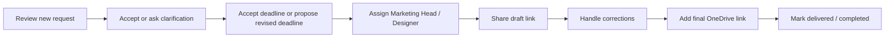

#### Do

- Keep deadline decision, status, assigned owner, draft link, and final OneDrive link current.
- Use comments for clarification, corrections, and delivery notes.
- Mark requests Completed when marketing work is finished; the app records completed date and completed-by user automatically.
- Keep heavy design files in local drive / OneDrive, not in the app.

#### Don't

- Do not upload large design assets into Jiva Farm OS.
- Do not mark delivered/completed without a final link when one is expected.

#### Escalate to

Management for priority conflicts; requester for missing brief details.

---

### Role: Designer

#### Daily purpose

Work assigned Marketing Requests and share draft/final links for review.

#### Primary menus

| Menu | What Designer does there | Access |
|---|---|---|
| Marketing Requests | Create requests, view own/assigned requests, update progress and links | ⭐ ✏️ ⚠️ |

#### Daily workflow map

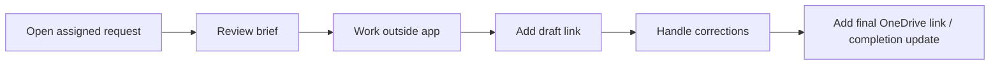

#### Do

- Update progress when work moves to In Progress, Draft Shared, or Corrections Requested.
- Add draft and final links when available.
- Add comments when clarification is needed.
- Mark assigned work Completed only when your current permissions allow editing that request and the work is actually finished.

#### Don't

- Do not cancel or finally deliver requests unless you also have Marketing Head/Admin/Management access.
- Do not store heavy design files inside the app.

#### Escalate to

Marketing Head for acceptance, cancellation, delivery, deadline changes, or priority conflicts.

---

### Role: Accounts

#### Daily purpose

Confirm payment and support finance-controlled dispatch readiness.

#### Primary menus

| Menu | What Accounts does there | Access |
|---|---|---|
| Dispatches | Review payment-related dispatch readiness | ⭐ ✏️ |
| Inventory | Device/stock visibility where allowed | 👁 |
| Farmer Leads | View lead payment context | 👁 ⚠️ |
| My Work | Payment/dispatch readiness and operational KPI visibility | 👁 |

#### Daily workflow map

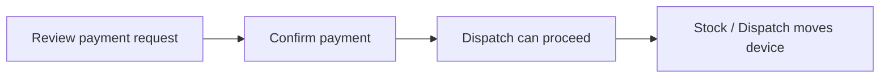

#### Do

- Confirm payment only when verified.
- Keep payment evidence and references accurate.
- Coordinate with Stock / Dispatch after payment confirmation.
- Confirm Dealer Dispatch payment before Dealer stock dispatch moves forward.
- Use Inventory for read-only stock visibility where permitted.

#### Don't

- Do not change sales ownership or field follow-up data.
- Do not mark installation or pilot statuses.

#### Common statuses they will see

| Status | Meaning | What user should do |
|---|---|---|
| Pending Payment Confirmation | Finance needs to verify | Confirm or hold |
| Approved for Dispatch | Payment/approval path complete | Hand off to Dispatch |
| On Hold | Cannot proceed | Clarify blocker |

#### Escalate to

Sales Head/RSM for commercial questions; Admin for system corrections.

---

### Role: Stock / Dispatch

#### Daily purpose

Manage device stock, dispatch movement, and installation handoff.

#### Primary menus

| Menu | What Stock / Dispatch does there | Access |
|---|---|---|
| Inventory | Maintain device stock and status | ⭐ ✏️ |
| Dispatches | Create/update dispatch movement | ⭐ ✏️ |
| Installations | Support installation workflow | ⭐ ✏️ |
| Farmer Leads | Update operational lead workflow where allowed | ✏️ ⚠️ |
| My Work | Stock and dispatch KPI visibility and actions | 👁 |

#### Daily workflow map

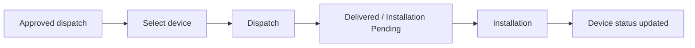

#### Do

- Keep serial number and device status accurate.
- Use Dispatches for device movement.
- Use Paid Farmer Sale for paid farmer leads, Free Pilot for free pilot movement, and Dealer Dispatch for paid dealer stock sales.
- Use Fresh Sale devices for paid farmer sale dispatches.
- Use Fresh Sale devices for Dealer Dispatch.
- Use Pilot Stock devices for free pilot dispatches.
- Use eligible Free Pilot lookup from Dispatch; Customer Service Team does not get broad Pilots module access.
- Confirm existing linked Pilot remains selected on Dispatch Edit.
- Remember a Device cannot be dispatched twice while an active/non-cancelled Dispatch exists.
- Status changes to `Dispatched` update Device lifecycle and create one movement record.
- Use Installations for field installation records.

#### Don't

- Do not confirm payment unless your role also permits it.
- Do not mark a Farmer Lead dispatched until dispatch status is `Dispatched`.
- Do not mark Pilot Device Installed from dispatch creation.
- Do not change pilot technical results.
- Do not reassign a moved Dispatch to another Device.

#### Common statuses they will see

| Status | Meaning | What user should do |
|---|---|---|
| In Warehouse | Device available | Dispatch when approved |
| Dispatched | Device moved out | Track delivery |
| Installed at Farmer Site | Farmer sale installation complete | Close device movement |

#### Escalate to

Accounts for payment holds; RSM/Sales Head for destination or farmer issues.

---

### Role: HR & Legal

#### Daily purpose

Review and approve dealer and institution legal documents.

#### Primary menus

| Menu | What HR & Legal does there | Access |
|---|---|---|
| Dealers | Legal agreement review/approval | ⭐ ⚠️ ✏️ |
| Institutional Partners | MOU/legal approval review | ⭐ ⚠️ ✏️ |
| Help / SOP | Operating guidance | ✅ |
| Change Password | Account security | ✅ |

#### Daily workflow map

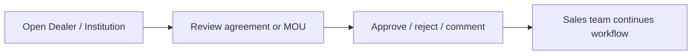

#### Do

- Update only legal approval fields and comments.
- Keep approval comments clear.
- Ask Sales Head/RSM for missing commercial context.

#### Don't

- Do not edit dealer performance, sales pipeline, or field workflows unless separately authorized.

#### Common statuses they will see

| Status | Meaning | What user should do |
|---|---|---|
| Under Review | Document needs legal review | Review document |
| Approved | Legal checkpoint complete | Sales can proceed |
| Rejected / Revision Required | Document needs changes | Add clear comments |

#### Escalate to

Sales Head for commercial questions; Admin for access/document issues.

---

### Role: Viewer

#### Daily purpose

Read operational information without changing records.

#### Primary menus

| Menu | What Viewer does there | Access |
|---|---|---|
| Operational modules | Read records and statuses | 👁 |
| My Work | Read permitted summaries and actions | 👁 |
| Help / SOP | Learn workflows | ✅ |
| Change Password | Account security | ✅ |

#### Daily workflow map


#### Do

- Use details pages to understand status.
- Share questions with the responsible role.

#### Don't

- Do not expect create/edit buttons.
- Do not use Viewer as a data-entry role.

#### Common statuses they will see

| Status | Meaning | What user should do |
|---|---|---|
| Any operational status | Read-only information | Ask owner to act |

#### Escalate to

Module owner or Admin.

## 6. Core Workflow Maps

### Farmer Lead To Installation

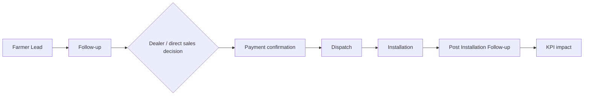

### Institution To Pilot To Scale-up

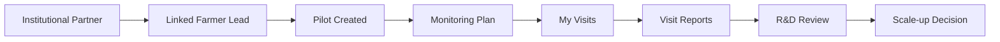

### Dealer To Sales Performance

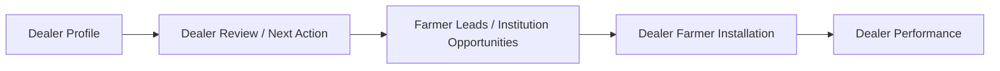

### Research Assistant Field Visit

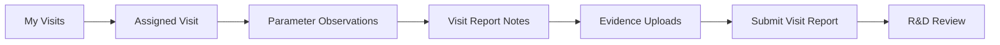

### Marketing Request Workflow

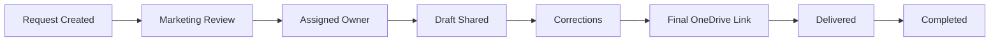

Rules:

- Requesters provide the brief in the app and may add an optional brief document link when extra context lives outside the app.
- Admin, Management, and Marketing Head can accept the requested deadline or propose a revised working deadline.
- Designers work from assigned requests and update draft/final links; they do not control final deadline acceptance unless they also have a management/marketing-head role.
- Heavy design files stay outside the app; Jiva Farm OS stores the request, links, comments, and status trail.
- Completed requests record completed date and completed-by user automatically.
- Completed requests are closed work in My Work, Data Quality, System Health, and n8n daily summary, but remain visible in Marketing Requests.

### My Work Triage

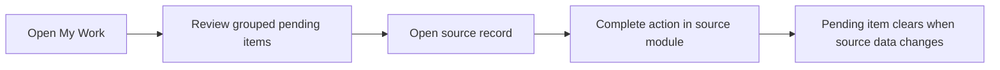

Rules:

- My Work is a live view, not a stored notification table.
- It uses existing records, permissions, RLS-safe queries, and role-scope helpers.
- It groups pending work into Sales, Dispatch, Pilots & Visits, and Marketing.
- It shows a maximum of four KPI cards for the user's role.
- It separates My Actions from Team Actions for supervisory roles and Oversight for Admin/Management.
- It dedupes the same business record so paid leads, marketing requests, and pilot work are not repeated in multiple sections.
- Updating the source record is what clears the pending item.

### Data Quality Review

```mermaid
flowchart LR
  A["Open Data Quality"] --> B["Review warnings"]
  B --> C["Open source record"]
  C --> D["Correct record through normal workflow"]
  D --> E["Warning clears when source data is corrected"]
```

Rules:

- Data Quality is visible to Admin and Management only.
- It is a live warning page, not a blocking validator.
- It does not merge, delete, or modify records.
- It checks duplicates, missing assignments, dispatch readiness, pilot setup, and marketing workflow completeness.

### System Health Review

```mermaid
flowchart LR
  A["Open System Health"] --> B["Review operational risk sections"]
  B --> C["Open source record"]
  C --> D["Unblock the process in the source module"]
  D --> E["Health item clears when the bottleneck is resolved"]
```

Rules:

- System Health is visible to Admin and Management only.
- It is read-only and does not change source records.
- It focuses on process bottlenecks: KPI cache, dispatch aging, installation aging, pilot/visit risk, marketing risk, and deleted-record visibility.
- It is separate from Data Quality, which focuses on duplicate and incomplete records.

### Dispatch To Installation

```mermaid
flowchart LR
  A["Dispatch"] --> B["Device movement"]
  B --> C["Installation"]
  C --> D["Device status"]
  D --> E["Post Installation Follow-up"]
```

### Paid Farmer Sale Dispatch

```mermaid
flowchart LR
  A["Payment Confirmed Farmer Lead"] --> B["Stock / Dispatch creates Farmer Sale Dispatch"]
  B --> C["Fresh Sale Device selected"]
  C --> D["Dispatch Requested"]
  D --> E["Dispatched"]
  E --> F["Farmer Lead marked Device Dispatched"]
```

Rules:

- Farmer Sale Dispatch must be created from a selected paid Farmer Lead.
- The Farmer Lead must have `payment_confirmed = true`, `device_dispatched = false`, and no active non-cancelled dispatch.
- Farmer destination details come from the selected Farmer Lead.
- Manual farmer destination entry is not part of the normal paid sale path.
- `device_dispatched` changes only when dispatch status becomes `Dispatched`.
- The selected Device must be Fresh Sale, in Warehouse/Reserved, held by Warehouse, and have no active/non-cancelled Dispatch.
- Dispatch Edit excludes the current Dispatch from duplicate checking.

### Free Pilot Dispatch

```mermaid
flowchart LR
  A["Active Pilot"] --> B["Stock / Dispatch creates Pilot Dispatch"]
  B --> C["Pilot Stock Device selected"]
  C --> D["Dispatch Requested"]
  D --> E["Dispatched"]
  E --> F["Pilot continues to installation / monitoring workflow"]
```

Rules:

- Pilot Dispatch must be created from a selected active Pilot.
- Pilot dispatch does not require payment.
- Pilot dispatch uses Pilot Stock devices only.
- Dispatch creation does not mark Pilot Device Installed.
- Customer Service Team can select eligible Free Pilots for dispatch through narrow lookup access, but does not get Pilots navigation or edit access.
- Existing linked Pilot remains selected on Dispatch Edit and does not need to be reselected when changing status.
- When Free Pilot Dispatch becomes `Dispatched`, the Device holder type is Pilot, the linked holder ID is the Pilot ID, the holder name is the Farmer name, and the location is Village, District, State.
- If a non-cancelled pilot dispatch already exists, create another only after business review.

### Dealer Dispatch

```mermaid
flowchart LR
  A["Dealer stock sale needed"] --> B["Stock / Dispatch creates Dealer Dispatch"]
  B --> C["Fresh Sale Device selected"]
  C --> D["Dispatch Requested"]
  D --> E["Accounts confirms dealer payment"]
  E --> F["Dispatched / Delivered"]
  F --> I["Dealer stock available for later farmer sales"]
  I --> G["Record farmer sale from Dealer detail"]
  G --> H["Dealer Farmer Installation"]
```

Rules:

- Dealer Dispatch must be created from a selected Dealer.
- Dealer Dispatch uses Fresh Sale devices only.
- The selected Device must be in Warehouse/Reserved, held by Warehouse, and have no active/non-cancelled Dispatch.
- Dealer Dispatch can select multiple eligible devices in one submission, but each serial-numbered device still gets its own dispatch row and movement history.
- Dealer Dispatch is a paid sale from Jiva to the Dealer.
- Accounts/Admin must confirm dealer payment before Stock / Dispatch can mark it Dispatched.
- Multi-device Dealer Dispatch payment is confirmed per dispatch row because the current schema has no shared dealer dispatch batch/payment record.
- Dealer Dispatch does not require a paid Farmer Lead.
- Dealer Dispatch does not require a Pilot.
- Dealer Dispatch does not mark a Farmer Lead as dispatched.
- Dealer Dispatch does not count as a farmer sale. Dealer-to-farmer sale is recorded later through a dealer-linked farmer sale or installation.
- Dealer detail shows dealer-stock serial numbers and stock state: Payment pending, Paid / ready for dispatch, In dealer stock, Sold to farmer, or Installed.
- Use Record farmer sale only when a serial-numbered dealer-stock device is sold to a farmer.
- Record farmer sale opens the Installation workflow as Dealer Farmer Installation, linked to the original Dealer Dispatch and selected Farmer Lead. If the farmer is not yet in the system, create the Farmer Lead first.
- Dealer farmer sale conversion must not create a second Jiva-to-farmer dispatch and must not auto-confirm payment.

### Pilot Authority Map

```mermaid
flowchart TD
  A["Pilot workflow"] --> B["Research Assistant"]
  A --> C["Agronomist / R&D Head / Admin"]
  A --> D["Admin / Management / R&D Head"]
  B --> B1["Submit Visit Reports"]
  B --> B2["Cannot mark Pilot Device Installed"]
  B --> B3["Cannot approve external sharing"]
  C --> C1["Manage pilot and device-installed authority where allowed"]
  D --> D1["Can set Approved for External Sharing"]
```

Future/deferred R&D workflow decision:

- The future Agronomist-created Monitoring Plan submission and R&D Head approval workflow is not documented as implemented.
- Current production behavior remains based on existing Pilot, Monitoring Plan, My Visits, Visit Reports, and R&D review permissions.

## 7. Menu-By-Menu Guide

### My Work

| Item | Detail |
|---|---|
| Purpose | Primary signed-in home page with role KPIs, owned actions, and scoped team/oversight work. |
| Used by | All signed-in roles. |
| Primary actions | Open pending items and continue work in the source module. |
| Important rules | This is a live view only. It does not send notifications, store notification rows, or change record permissions. `/dashboard` redirects here for older links. |

### Data Quality

| Item | Detail |
|---|---|
| Purpose | Surface duplicate, incomplete, or handoff-risk records before they affect reporting or operations. |
| Used by | Admin and Management. |
| Primary actions | Review warnings, open the source record, and correct through the normal module workflow. |
| Important rules | Warnings only. No hard constraints, no merge/delete actions, no workflow blocking, and no SQL/RLS changes. |

### System Health

| Item | Detail |
|---|---|
| Purpose | Monitor operational risk, process bottlenecks, stale KPI/cache signals, aging handoffs, and deleted-record visibility. |
| Used by | Admin and Management. |
| Primary actions | Review health sections, open source records, and unblock work in the source module. |
| Important rules | Read-only. No cleanup buttons, no workflow blocking, no stored alert table, and no SQL/RLS changes. |

### Farmer Leads

| Item | Detail |
|---|---|
| Purpose | Capture, track, and convert farmer sales opportunities. |
| Used by | Admin, Management, Sales Head, RSM, Salesperson, Research Assistant, Agronomist, Accounts, Stock / Dispatch, R&D Head, Viewer. |
| Primary actions | Create leads, update funnel stage, track follow-ups, confirm payment where allowed, link dealer/institution/pilot context. |
| Important rules | Device Installed is workflow-controlled. Payment confirmation is Admin/Accounts. Research Assistant lead selection for pilots is geography-scoped. |

### Dealers

| Item | Detail |
|---|---|
| Purpose | Manage dealer profiles, onboarding, reviews, and dealer-linked performance. |
| Used by | Admin, Sales Head, RSM, Salesperson, Management, Agronomist, R&D Head, HR & Legal, Viewer. |
| Primary actions | Create dealer, update review/next action, manage institution opportunities, legal approval where allowed. |
| Important rules | Sales Head can create and soft-delete Dealer profiles. Soft-deleted dealers are removed from active views, but linked history is preserved. Delete reason and deleted-by are captured. Admin can view deleted dealers explicitly and restore them. Dealer performance counts dealer-linked Dealer Farmer Installations. |

### Institutional Partners

| Item | Detail |
|---|---|
| Purpose | Manage institution relationships, pilots, proposals, MOU/legal status, and scale-up opportunity. |
| Used by | Admin, Management, Sales Head, RSM, R&D Head, Agronomist, HR & Legal, Viewer. |
| Primary actions | Create/manage institution profile, contacts/meetings, pilot opportunity, MOU/legal approval where allowed. |
| Important rules | Sales Head can soft-delete Institutional Partners. Soft-deleted institutions are removed from active views, but contacts, meetings, linked pilots, and history are preserved. Delete reason and deleted-by are captured. Admin can view deleted institutions explicitly and restore them. Proposal and MOU fields remain. |

### Pilots

| Item | Detail |
|---|---|
| Purpose | Track trials, monitoring visits, results, and scale-up proof. |
| Used by | Admin, Management, R&D Head, Agronomist, Research Assistant, Sales Head, RSM, Salesperson, Viewer. |
| Primary actions | Create pilot, add monitoring plan, assign visits, submit reports, review result, mark Pilot Device Installed where allowed. |
| Important rules | R&D Head can soft-delete Pilots. Admin and Management can also soft-delete Pilots. Visit plans, reports, and linked context are preserved. Delete reason and deleted-by are captured. Admin can view deleted pilots explicitly and restore them. Research Assistant cannot mark Pilot Device Installed. |

### My Visits

| Item | Detail |
|---|---|
| Purpose | Field visit workbench for assigned planned pilot visits. |
| Used by | Roles with Pilot access, especially Research Assistant. |
| Primary actions | Start/continue visit, submit Visit Report, upload evidence, complete observations. |
| Important rules | Needs report excludes future planned/assigned visits; In Progress means report is pending. |

### Dispatches

| Item | Detail |
|---|---|
| Purpose | Move devices from stock to farmer/dealer/institution/pilot destination. |
| Used by | Admin, Accounts, Stock / Dispatch, Sales Head, RSM, Agronomist, R&D Head, Viewer. |
| Primary actions | Request/approve/dispatch/deliver devices, track payment requirement. |
| Important rules | Dispatched workflow depends on payment/approval rules and Stock / Dispatch authority. |

Dispatch creation routes:

- Paid Farmer Sale: selected paid Farmer Lead, Fresh Sale device only.
- Free Pilot: selected active Pilot, Pilot Stock device only.
- Dealer Dispatch: selected Dealer, Fresh Sale device only; paid dealer sale, not farmer sale.
- Manual dispatch — admin exception: Admin-only for unusual movement.

### Installations

| Item | Detail |
|---|---|
| Purpose | Record device installation at farmer, dealer farmer, pilot, institution, replacement, or trial site. |
| Used by | Admin, Sales Head, RSM, Salesperson, Stock / Dispatch, Management, Agronomist, R&D Head, Viewer. |
| Primary actions | Create/update installation, confirm field details, trigger follow-up. |
| Important rules | Farmer Sale and Dealer Farmer Installations can drive Farmer Lead Device Installed state. Pilot Installation does not count as farmer sale. |

### Post Installation Follow-ups

| Item | Detail |
|---|---|
| Purpose | Track post-installation and technical follow-up work. |
| Used by | Admin, Management, R&D Head, Sales Head, RSM, Salesperson, Research Assistant, Agronomist, Viewer. |
| Primary actions | Complete follow-up, capture issue, create technical report where allowed. |
| Important rules | Technical report creation is Admin, Management, R&D Head, Agronomist, or Research Assistant. |

### Inventory and Device Records

| Item | Detail |
|---|---|
| Purpose | Manage warehouse stock, in-transit stock, dealer stock, installed devices, serial numbers, status, location, and device lifecycle. |
| Used by | Admin, Management, Sales Head, Accounts, Stock / Dispatch, Agronomist, R&D Head, Viewer. |
| Primary actions | Add/update device status, track warehouse/dealer/farmer/pilot/device return. |
| Important rules | `/devices` is the canonical technical route and `/inventory` redirects to it. Agronomist is view-only for Inventory. Stock / Dispatch owns operational stock movement. |

Device pool:

- Fresh Sale Device: used for paid farmer-sale dispatches.
- Pilot Device: used for free pilot dispatches.
- Admin and Stock / Dispatch can set the device pool on device create/edit.

### Marketing Requests

| Item | Detail |
|---|---|
| Purpose | Track marketing briefs, brief document links, requested/final deadlines, assignment, corrections, draft links, final OneDrive links, and delivery status. |
| Used by | Admin, Management, Sales Head, RSM, Salesperson, Agronomist, Research Assistant, R&D Head, Marketing Head, Designer. |
| Primary actions | Create request, review brief, assign owner, share draft/final links, add comments, mark delivered/completed where allowed. |
| Important rules | Heavy design files stay outside the app. The in-app brief is required; the brief document link is optional. Admin, Management, and Marketing Head can accept the requested deadline or propose a revised working deadline. OneDrive link is optional until delivery. Completed requests record completed date and completed-by user automatically and are closed work. Accounts, Stock / Dispatch, HR & Legal, and Viewer do not create requests by default. |

### Regions

| Item | Detail |
|---|---|
| Purpose | Manage active regions, assigned RSM, state, and annual targets. |
| Used by | Admin, Management, Sales Head. |
| Primary actions | Create/update regions and RSM assignment. |
| Important rules | Region setup affects assignment, filtering, and scoped visibility. |

### Internal Users

| Item | Detail |
|---|---|
| Purpose | Manage user profile, role, secondary role, activation, and reporting structure. |
| Used by | Admin. |
| Primary actions | Create users, set role/secondary role, activate/deactivate, set manager/region. |
| Important rules | First-login password change is enforced through `must_change_password`. |

### Help / SOP

| Item | Detail |
|---|---|
| Purpose | In-app operating guidance. |
| Used by | All signed-in users. |
| Primary actions | Read role and workflow guidance. |
| Important rules | Help does not change records. |

### Change Password

| Item | Detail |
|---|---|
| Purpose | Change logged-in password and clear temporary-password requirement. |
| Used by | All signed-in users. |
| Primary actions | Enter new password and confirm password. |
| Important rules | Users with temporary password must change it before using other app areas. |

## 8. Status Quick Reference

### Farmer Lead Statuses

| Status | Meaning | Who acts next | Menu |
|---|---|---|---|
| Open | Lead is active | Salesperson / RSM | Farmer Leads |
| Won | Sale completed | Dispatch / Installation | Farmer Leads, Dispatches, Installations |
| Lost | Lead is lost | Sales Head / RSM review | Farmer Leads |
| Parked | Lead is paused | Sales Head / RSM review | Farmer Leads |

### Farmer Lead Funnel Stages

| Status | Meaning | Who acts next | Menu |
|---|---|---|---|
| Lead Captured | New lead entered | Salesperson / RSM | Farmer Leads |
| First Contact Done | Initial contact complete | Salesperson / RSM | Farmer Leads |
| Product Recommended | Product proposed | Salesperson / RSM | Farmer Leads |
| Quotation / Estimate Shared | Commercial details shared | Salesperson / RSM | Farmer Leads |
| Follow-up Active | Sales follow-up running | Salesperson / RSM | Farmer Leads |
| Payment Confirmed | Finance checkpoint complete | Dispatch team | Farmer Leads / Dispatches |
| Pilot Agreed | Farmer agreed to pilot | Agronomist / RA / R&D | Farmer Leads / Pilots |
| Pilot Active | Pilot is active | Agronomist / RA | Pilots |
| Pilot Completed - Sales Follow-up | Pilot done, sales follow-up needed | Salesperson / RSM | Farmer Leads |
| Device Dispatched | Device sent | Stock / Dispatch | Dispatches |
| Device Installed | Installation workflow completed | Installation / Follow-up owner | Installations / Follow-ups |
| 15-Day Follow-up Completed | Post-installation follow-up done | RSM / Sales Head | Follow-ups |
| Repeat / Referral Opportunity | Future sales opportunity | Salesperson / RSM | Farmer Leads |
| Won | Sale won | Dispatch / Installation | Farmer Leads |
| Lost | Lead lost | RSM / Sales Head | Farmer Leads |
| Parked | Lead paused | RSM / Sales Head | Farmer Leads |

### Dealer Statuses

| Status | Meaning | Who acts next | Menu |
|---|---|---|---|
| Prospect | Dealer is being evaluated | RSM / Sales Head | Dealers |
| Onboarding | Dealer setup in progress | RSM / Sales Head / HR & Legal | Dealers |
| Active | Dealer is operational | RSM | Dealers |
| Dormant | Dealer is inactive or stuck | RSM / Sales Head | Dealers |
| Dropped | Dealer opportunity stopped | Sales Head | Dealers |

### Pilot Statuses

| Status | Meaning | Who acts next | Menu |
|---|---|---|---|
| Planned | Pilot created but not active | Agronomist / R&D | Pilots |
| Approved | Pilot approved | Agronomist / RA | Pilots |
| Device Assigned | Device selected | Stock / Dispatch / Agronomist | Pilots / Inventory |
| Device Dispatched | Device sent for pilot | Stock / Dispatch | Dispatches / Pilots |
| Device Installed | Pilot device installed | Agronomist / R&D / Admin | Pilots |
| Monitoring Active | Field monitoring is active | RA / Agronomist | My Visits / Pilots |
| Visit Report Pending | Report needed | Research Assistant | My Visits |
| Final Report Pending | Final review needed | R&D Head | Pilots |
| Final Report Submitted | Submitted for review | R&D Head | Pilots |
| Final Report Reviewed | R&D review done | R&D Head / Management | Pilots |
| Scale-up Recommended | Scale-up suggested | Sales Head / Management | Pilots / Institutions |
| Closed - Successful | Pilot closed positively | R&D / Management | Pilots |
| Closed - Failed | Pilot closed negatively | R&D | Pilots |
| Closed - Inconclusive | Pilot closed without clear result | R&D | Pilots |
| Parked | Pilot paused | Agronomist / R&D | Pilots |
| Cancelled | Pilot stopped | R&D / Admin | Pilots |

### Planned Visit Statuses

| Status | Meaning | Who acts next | Menu |
|---|---|---|---|
| Planned | Visit scheduled | Research Assistant | My Visits |
| Assigned | Visit assigned | Research Assistant | My Visits |
| Due | Visit is due | Research Assistant | My Visits |
| In Progress | Visit started, report pending | Research Assistant | My Visits |
| Completed | Visit/report complete | Agronomist / R&D | Pilots |
| Rescheduled | Visit date changed | Agronomist / RA | Pilots |
| Cancelled | Visit cancelled | Agronomist / R&D | Pilots |
| Unable to Complete | Visit could not be done | Agronomist / RA | My Visits / Pilots |

### Visit Report Statuses

| Status | Meaning | Who acts next | Menu |
|---|---|---|---|
| Draft | Report not final | Research Assistant | My Visits / Pilots |
| Submitted | Report submitted | Agronomist / R&D | Pilots |
| Reviewed | Review complete | R&D / Agronomist | Pilots |
| Revision Required | Needs correction | Research Assistant | Pilots / My Visits |
| Approved | Approved internally | R&D Head | Pilots |
| Archived | Historical record | Viewer / Admin | Pilots |

### Dispatch Statuses

| Status | Meaning | Who acts next | Menu |
|---|---|---|---|
| Dispatch Requested | Dispatch request created | Accounts / Dispatch | Dispatches |
| Pending Payment Confirmation | Payment check needed | Accounts | Dispatches |
| Pending Approval | Approval needed | Admin / Sales Head / Accounts | Dispatches |
| Approved for Dispatch | Ready to dispatch | Stock / Dispatch | Dispatches |
| Dispatched | Device sent | Stock / Dispatch | Dispatches |
| Delivered | Device delivered | Installation owner | Dispatches / Installations |
| Installation Pending | Installation not done yet | RSM / Installation owner | Installations |
| Installed | Installation done | Follow-up owner | Installations / Follow-ups |
| On Hold | Blocked | Responsible owner | Dispatches |
| Cancelled | Dispatch stopped | Admin / Dispatch | Dispatches |

### Installation Statuses

| Status | Meaning | Who acts next | Menu |
|---|---|---|---|
| Planned | Installation planned | RSM / Stock / Dispatch | Installations |
| Installed | Installation completed | Follow-up owner | Installations |
| Verified | Installation verified | Admin / RSM | Installations |
| Follow-up Pending | Follow-up needed | Follow-up owner | Follow-ups |
| Issue Reported | Problem found | Agronomist / RSM / Dispatch | Installations |
| Closed | Installation workflow closed | Admin / RSM | Installations |
| Cancelled | Installation stopped | Admin / RSM | Installations |

### Post-installation Follow-up Statuses

| Status | Meaning | Who acts next | Menu |
|---|---|---|---|
| Due | Follow-up due | Assigned owner | Follow-ups |
| Completed | Follow-up done | RSM / Sales Head | Follow-ups |
| Missed | Follow-up missed | Owner / RSM | Follow-ups |
| Rescheduled | Follow-up date changed | Owner | Follow-ups |
| Cancelled | Follow-up cancelled | Admin / Owner | Follow-ups |
| Escalated | Needs higher attention | RSM / Sales Head / Agronomist | Follow-ups |

### Device Statuses

| Status | Meaning | Who acts next | Menu |
|---|---|---|---|
| In Warehouse | Available stock | Stock / Dispatch | Inventory |
| Reserved | Held for workflow | Stock / Dispatch | Inventory |
| Dispatch Approved | Ready for dispatch | Stock / Dispatch | Inventory / Dispatches |
| Dispatched | Sent out | Stock / Dispatch | Dispatches |
| With Dealer | Dealer holds stock | RSM / Dealer owner | Dealers / Inventory |
| With Farmer | Farmer has device | Installation/follow-up owner | Inventory |
| Installed at Farmer Site | Farmer installation complete | Follow-up owner | Installations / Follow-ups |
| Installed for Pilot | Pilot device installed | Agronomist / R&D | Pilots |
| Returned | Device returned | Stock / Dispatch | Inventory |
| Replacement | Replacement device | Stock / Dispatch | Inventory |
| Reinstalled | Reinstalled device | Installation owner | Installations |
| Damaged | Damaged stock | Stock / Dispatch / Admin | Inventory |
| Hold | Temporarily blocked | Stock / Dispatch | Inventory |
| Lost | Lost device | Admin / Stock | Inventory |
| Retired | Retired device | Admin / Stock | Inventory |

## 9. Role-Specific Important Rules

| Rule | Confirmed source |
|---|---|
| Notifications / Action Center shows assignments, reminders, mentions, and workflow updates for the signed-in user only. | Notifications table RLS and app shell bell. |
| Marketing Request assignment and Planned Pilot Visit assignment create in-app notifications for the assigned user. | Marketing and Pilot server actions. |
| Mention notifications are deferred until user mentions can be matched safely and uniquely. | Notifications rollout note. |
| Sales Head can create Dealer profiles. | `canCreateDealer` includes Admin, Sales Head, RSM. |
| Dealer statuses are Prospect, Onboarding, Active, Dormant, Dropped. | Dealer options. |
| Dealer sales performance counts dealer-linked Dealer Farmer Installations only. | Dealer performance logic and project status notes. |
| Research Assistant Farmer Lead selection for Pilot creation is assigned region/state scoped. | Pilot Farmer Lead option logic and RLS migration note. |
| Research Assistant can see eligible Farmer Leads in assigned geography for Pilot creation. | Pilot Farmer Lead option logic. |
| Research Assistant cannot mark Pilot Device Installed. | Pilot form/action authority excludes RA. |
| Admin, R&D Head, and Agronomist can mark Pilot Device Installed. | Pilot form/action authority. |
| Visit Report Notes replace the previous eight narrative fields. | Visit report form/data mapping. |
| Evidence Uploads includes Report photos and Report data sheet. | Visit report form. |
| Approved for External Sharing is hidden from Research Assistant. | Visit report form. |
| Only Admin, Management, and R&D Head can set/change approved_for_partner_sharing. | Pilot actions server-side guard. |
| My Work shows role-specific KPIs and pending work. | My Work page. |
| RSM My Work uses live scoped KPI/action data. | My Work page. |
| Research Assistant My Work uses live user-specific counts and visit actions. | My Work page. |

## 10. Items To Confirm With Harsha

| Item | Why it needs confirmation |
|---|---|
| Management write access in Pilots | Code permits Management in Pilot write roles, but day-to-day ownership appears R&D/Agronomist-led. |
| Salesperson My Work content | Salesperson can view My Work, but visible KPI/action sections may be limited compared with supervisory roles. |
| HR & Legal home access | Code does not include HR & Legal in the main home view roles; they still get Help and Change Password. |
| Viewer My Visits usefulness | Viewer can see Pilot module and My Visits menu because My Visits uses Pilot access, but it remains read-only. |
